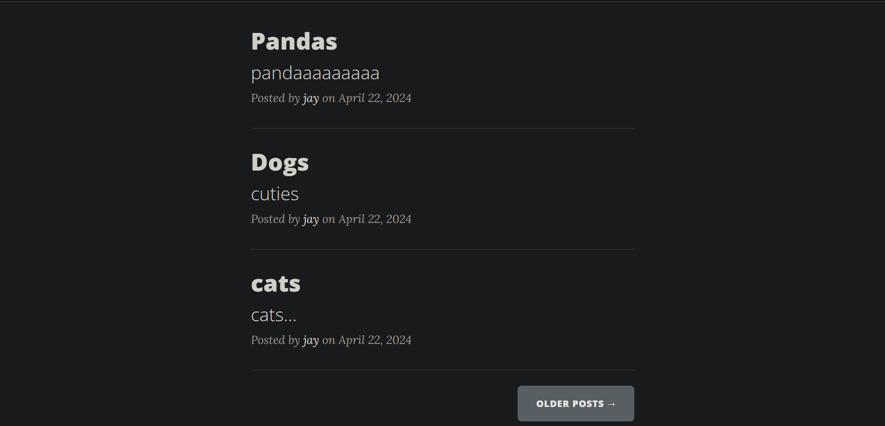

# Blog_Template
# Flask Blog App

This is a simple blog application built using Flask, a lightweight Python web framework. The app allows users to create, read, update, and delete blog posts. It includes user authentication and authorization features.

## Features

- **User Authentication**: Users can sign up, log in, and log out securely.
- **Password Hashing and Salting**: All the user passwords are hashed and then added to the database.
- **Authorization**: Differentiate between regular users and admin users.
- **CRUD Operations**: Create, read, update, and delete blog posts.
- **Blog Post Categories**: Categorize blog posts into different categories.
- **Responsive Design**: UI is designed to be responsive and user-friendly.
- **Search Functionality**: Users can search for specific blog posts.
- **Comment System**: Users can comment on blog posts.

## Installation

### Clone the Repository

```bash
git clone https://github.com/IceBerG-15/Blog_Template.git
cd flask-blog-app
```
### Create and Activate Virtual Environment

```bash
python3 -m venv venv
activate venv
```

### Install dependencies

```bash
pip install -r requirements.txt
```

## Usage

### Run the application

```bash
set FLASK_APP=main.py
flask run
```
#### OR

```bash
python main.py
```

### Access the application

http://localhost:5002

### User Registration and Login:
Register a new account or log in with existing credentials.

### Manage Blog Posts:

Navigate through different blog posts, categories, and add your own posts.

### Interact with Comments:

Users can comment on blog posts.

## Contributing

Contributions are welcome! If you find any issues or would like to contribute enhancements, please fork the repository and submit your changes as a pull request.

## Screenshots





